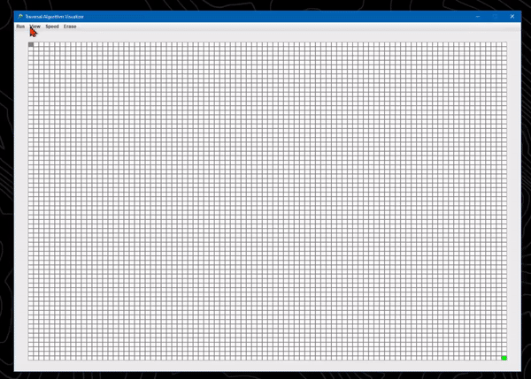
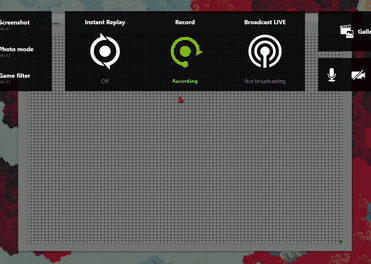
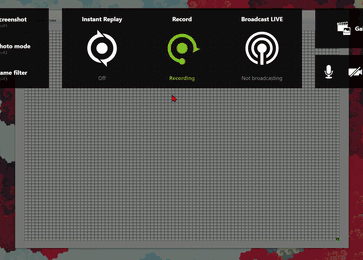

# Breadth-First & Depth-First Search GUI (Visual)
This is a GUI that allows the user to draw custom paths and see how a Breadth-First search algorithm navigates it.

# How it Works
The top left part of the grid (the gray square) is where the algorithm begins it's search. It will keep searching until it reaches the bottom left part of the grid (the green square). Users can simply click on random spots of the grid and draw borders that the algorithm has to work around. 

# Customizable Look and Feel
Change the layout colors, remove borders, and add text to each box. You can also change the speed of the visualization. You can make it really slow to clearly see how the algorithms work or you can make it really fast. 

# How to Run the Application
1. Download java runtime environment (jre) version 8 <a href="https://www.oracle.com/technetwork/java/javase/downloads/jre8-downloads-2133155.html">here</a> if you don't have it already.
2. Download and double-click on the executable InteractivePathFinding.jar file.

# Author
<a href="https://github.com/btror">Brandon</a>