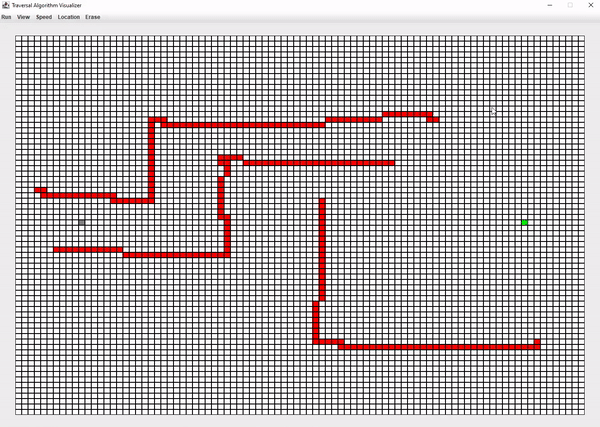
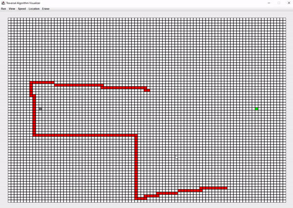
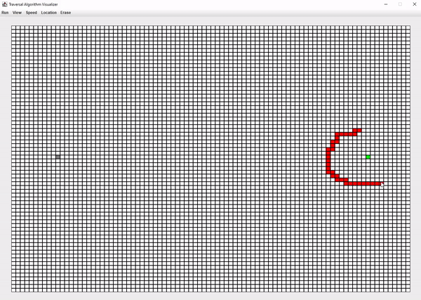
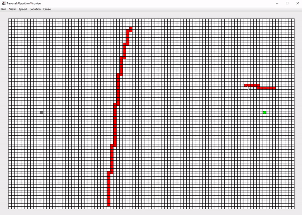

# Traversal Algorithm Visualizer with A* 
GUI visualizing BFS and DFS traversal algorithms and different A* path finding implementations.

## How it Works
The gray square is where the algorithm begins it's search. It will keep searching until it reaches the green sqaure. Users can simply click on random spots of the grid and draw borders that the algorithm has to work around. 

## Breadth First Search

## Depth First Search

## A* (diagonal movement disabled)

## A* (diagonal movement enabled)

## How to Run the Application
1. Download java runtime environment (jre) version 8 <a href="https://www.oracle.com/technetwork/java/javase/downloads/jre8-downloads-2133155.html">here</a> if you don't have it already.
2. Download and double-click on the executable InteractivePathFinding.jar file.

## Author
<a href="https://github.com/btror">Brandon</a>
